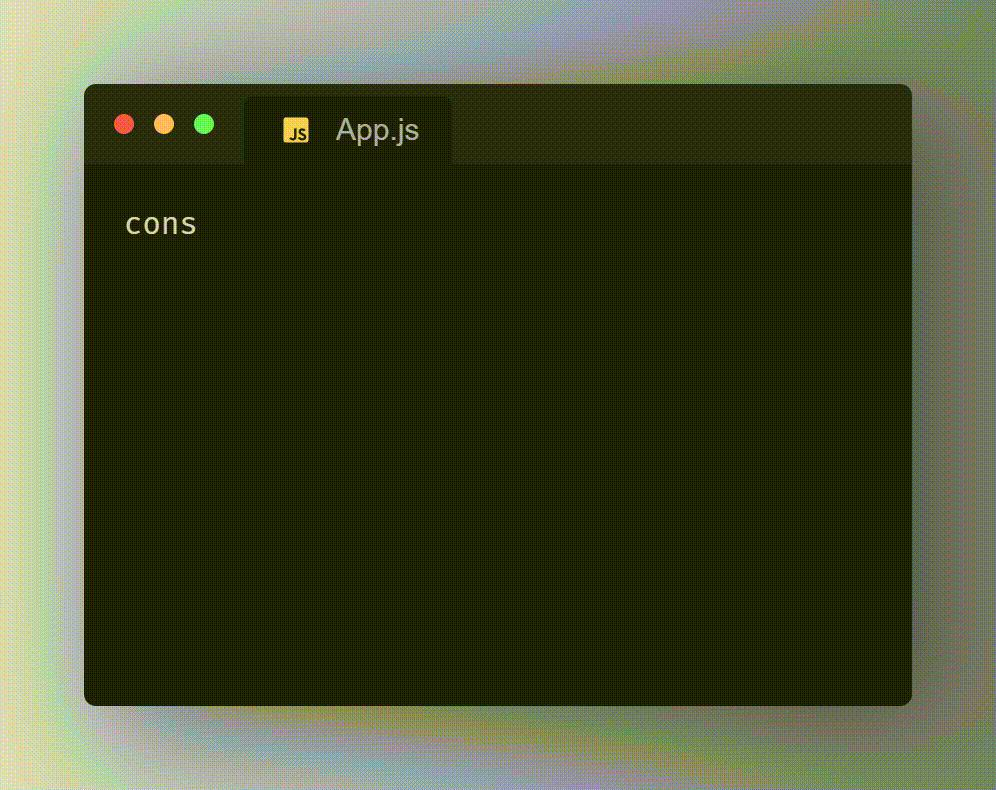

## Hi there 👋
I'm glad you visited my profile. Are you ready to learn a bit more about me and my skills as a junior developer? Let's get started!

## 💫 About Me:
My name is Łukasz Kumela, and I'm a programming enthusiast with a strong desire to grow in the world of technology. While my experience may be in its early stages, I certainly make up for it with enthusiasm, dedication, and a knack for quick learning.
## 💻 Skills

  

 
  
 
  
  
  

 

  
  

  

### ⚙ Others

- Basic understanding of object-oriented programming concepts
- Problem-solving skills and analytical thinking

## 📖 What Am I Currently Doing?

I am currently focused on expanding my skills through:

- Participating in online courses
- Doing practical projects to apply acquired knowledge
- Reading industry blogs and articles

## 🤖 Future Plans

In the coming years, my focus is on continuous learning to deepen my skills, particularly in Back-end development. I am determined to actively seek new opportunities and secure a fulfilling position in the tech industry, leveraging my knowledge and passion for innovation.

## 📞 Contact

- Email: l.kumela@outlook.com
- GitHub: [lukaszkumela](https://github.com/lukaszkumela)

Thanks for visiting my profile!